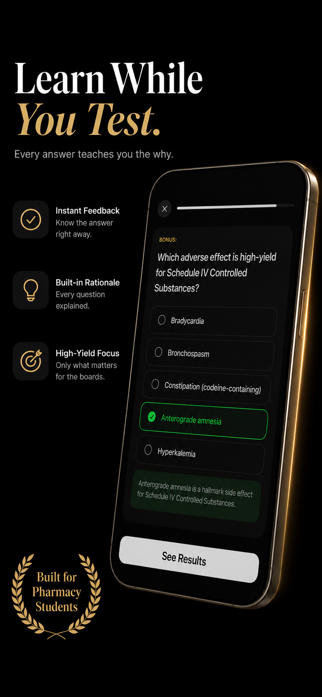
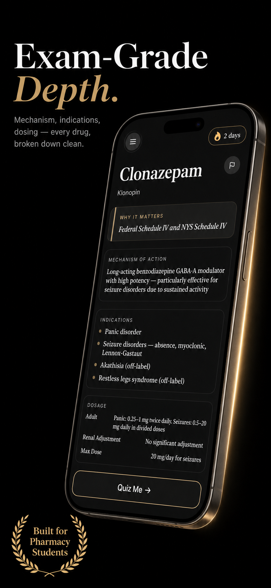

# MemoRx

Pharmacology study app for NAPLEX board prep — adaptive quizzing with spaced repetition across 200+ drugs spanning 30 therapeutic classes.

  
  &nbsp;&nbsp;&nbsp;&nbsp;
  

## Tech Stack

- **SwiftUI** — full declarative UI, dark mode, custom design system
- **Supabase** — Postgres database, Auth, Edge Functions (Deno/TypeScript), Row-Level Security
- **StoreKit 2** — subscriptions with server-side receipt validation
- **Apple JWS verification** — x5c chain validation anchored to Apple Root CA G3 for App Store Server Notifications
- **Spaced repetition engine** — SM-2 inspired algorithm with adaptive difficulty and per-drug mastery tracking
- **RevenueCat** — subscription analytics and entitlement management

## Architecture Highlights

**Adaptive quiz engine** — Questions are weighted by drug difficulty rating, user mastery level, and time since last review. The spaced repetition scheduler surfaces drugs right before they'd be forgotten, with class-level quizzing for cross-drug comparisons.

**Server-side subscription security** — Edge functions verify Apple JWS signatures with full x5c certificate chain validation (not just decoding the payload). The `sync-subscription` and `apple-s2s` endpoints share a pinned Apple Root CA verifier that rejects self-signed or forged receipts.

**Real-time progress sync** — User progress, streaks, and XP sync to Supabase with offline-first local state. Weekly leaderboard snapshots are archived via `pg_cron`, and App Store Connect metrics are pulled daily through a scheduled edge function.

## Setup

1. Clone the repo and open `MemoRx.xcodeproj` in Xcode
2. Copy `Config/Supabase.example.xcconfig` → `Config/Supabase.xcconfig` and fill in your Supabase project credentials
3. Build and run on iOS 17+

## License

All rights reserved.
